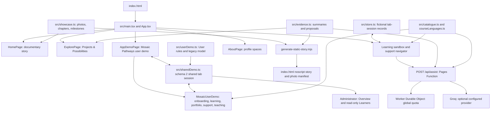

# Architecture and maintenance reference

Current continuation (8 October 2026): User, Administrator waves 1–4 and the [learner scorecard/threshold follow-up](LEARNER-SCORECARD.md) are complete locally. Next: wave 5 consolidated Administrator closeout. Read [the current handoff](../SESSION-HANDOFF.md#next-session-brief); earlier milestones in this document retain their historical scope. Changes remain uncommitted and unpublished.

Current continuation checkpoint (7 October 2026): [Administrator wave 2](ADMINISTRATOR-WAVE-2.md) implements application/support decisions, immutable history and User responses. Next is wave 2 user review, then wave 3 roster/course coordination. [Main handoff](../SESSION-HANDOFF.md) takes precedence over earlier checkpoint descriptions below.

Checkpoint: 7 October 2026. Read [the session handoff](../SESSION-HANDOFF.md) for project history, verified content and next-session intent.

The User stage is closed out with eight courses (48 lessons/39 questions), including English-first AI, workplace and livelihood courses. Both User and sandbox loaders append missing seed courses to saved catalogues without replacing existing activity or authored content. The original three-course translations remain unchanged. Read [User closeout](USER-STAGE-CLOSEOUT.md) and the [full Administrator plan](ADMINISTRATOR-DEMO-PLAN.md) for the baseline. [Administrator wave 1](ADMINISTRATOR-WAVE-1.md) now provides shared session ownership, revisions/submission history, Overview and read-only learner detail.

## Grant-planning reports (10 October 2026)

`grantPlanning.ts` derives scoped cohort breakdowns and separate aggregate/detailed CSV whitelists. `GrantPlanningReport.tsx` provides labelled bar charts, equivalent tables, filters and independent roster/export controls. `grantPlanningPdf.ts` generates aggregate A4 chart pages locally using canvas and a PDF writer; no remote service or new dependency. `nigeriaLocationIndex.ts` contains only canonical names from the pinned map asset. Reports unmounts on role exit; scope/state changes reset disclosure/export selections. Shared schema remains version 2. See [metric/export definitions](GRANT-PLANNING-REPORT.md).

## Application structure

The project is a React application with two production dependencies: React and React DOM. TypeScript and Vite handle compilation/building. Browser tests use Playwright and axe. CSS, IntersectionObserver and requestAnimationFrame implement documentary motion without an animation dependency. Pages Functions and a separate Cloudflare Worker implement optional server-side AI assistance.



Photo metadata is presentation-only. The AI endpoint imports `evidence.ts` and `catalogue.ts`; it does not import `showcase.ts` or the photo manifest. There is no participant database behind the browser state.

## File map

| File / directory | Responsibility | Editing notes |
|---|---|---|
| `src/main.tsx` | Mounts React and imports the primary stylesheet | Browser entry point |
| `src/App.tsx` | App navigation, access controls, role views, forms, course authoring, support navigator and state persistence | Main sandbox behaviors are still in this larger file; cosmetic homepage work usually needs little change here |
| `src/HomePage.tsx` | Story composition, leadership and further reading, chapters with grouped photographs, timeline and source register | Primary homepage composition surface |
| `src/Timeline.tsx` | Twelve-event, year-filtered timeline with boundary controls and source-matched photographs | Selection scrolls the date strip only |
| `src/ExplorePage.tsx` | Projects & Possibilities: five proposals, pilot discussion, downloads and links to demos | Main navigation label differs from the component filename |
| `src/AppDemoPage.tsx` | Shared session owner, User/Administration role panels, storage warning/recovery and reset; Facilitator deferred | Keyboard tabs support arrows, Home and End |
| `src/MosaicUserDemo.tsx`, `src/userDemo.css` | English adult onboarding, dashboard, learning, portfolio, support, teaching and presenter controls | Scoped styling, mobile menu, text-first lessons and printable demo record |
| `src/sharedDemo.ts`, `src/sharedDemo.test.ts` | Schema 2 envelope, verified legacy backup/migration, record revisions, submission snapshots, milestone events and scoped reset | Same primary key, backup retained until reset; invalid saved data never silently replaced |
| `src/AdministratorDemo.tsx`, `src/administratorMetrics.ts` | Read-only Overview/Learners, derived counts and search | No administrator assessment/decision mutations; optional personal/evidence details collapsed |
| `src/userDemo.ts`, `src/userDemo.test.ts` | User payload/rules, profile, evidence metadata, recommendations, requests and application gates | `mosaic-user-demo-v1`; reuses store completion rules; no server uploads |
| `src/AboutPage.tsx` | Blank named portrait and biography spaces | No personal profile content supplied |
| `src/PhotoCaption.tsx` | Shared photograph caption and provenance links | Used by chapter, timeline and dialog presentation |
| `src/showcase.ts` | Documentary sources, photo records, achievement records, hero selection and milestones | Canonical documentary data; stable IDs link navigation, gallery, timeline and tests |
| `src/evidence.ts` | Reviewed AI-compatible source summaries, five proposal records and expiry helper | Used by Projects & Possibilities and server; changing summaries changes AI context |
| `src/PhotoCarousel.tsx` | Opening slideshow and reusable `DocumentaryImage` | Three selected photos; timing, focus/hover/manual pause, swipe and image fallback |
| `src/ProgrammeScenes.tsx` | `ProgrammeScenes` and `PhotoCaption` | Desktop enhancement, chapter activation and text reveals; mobile baseline remains normal content |
| `src/PhotoGallery.tsx` | Shared photograph context, expandable photos and native modal dialogs; standalone gallery component retained but not rendered on Home | Includes focus and scroll restoration |
| `src/useReducedMotion.ts` | Combines app setting with OS media preference | Used by homepage motion; carousel also listens to OS preferences |
| `src/style.css` | Shared app and documentary presentation | Earlier base styles plus later documentary overrides; check cascade before changing selectors |
| `src/store.ts` | State types, seeds, enrolment, completion, recommendations, quiz grading and loading | Logic independently tested |
| `src/catalogue.ts` | English original courses and course types | Reviewed catalogue for AI also comes from this file |
| `src/i18n.ts` | Language options and translated interface strings | Language codes: en, ha, yo, ig |
| `src/courseLanguages.ts` | Sample-course text/assessment translations | Keeps original assessment answer indexes and skill metadata |
| `functions/api/assist.ts` | Validates requests, reserves quota, calls provider and validates responses | Server-only key/binding; local Vite does not execute it |
| `worker/limiter.ts` | Persistent global quota Durable Object | Three counters; no prompt, identity or IP storage |
| `wrangler.toml` | Pages project name, build directory and Worker binding | Deployment configuration, not a credential store |
| `worker/wrangler.toml` | Worker name, SQLite Durable Object migration and disabled workers.dev endpoint | Existing class name and script name must match Pages binding |
| `public/photos/` | Ten accepted WebPs | Served locally; full photographic frames retained |
| `public/_headers` | CSP and other response headers | Production smoke applies this CSP; avoid adding unapproved third-party resources |
| `public/static-story.css` | No-JavaScript presentation | Separate from `src/style.css` |
| `public/downloads/` | Introduction PDF, proposal PDF and walkthrough | Static downloadable assets copied into the build |
| `scripts/generate-static-story.mjs` | Generates static story and photo manifest from TypeScript records | Runs before typecheck/Vite in the build script |
| `scripts/collect-documentary.py` | Re-downloads accepted images from the manifest | Checks dimensions before replacement; no cropping or upscaling |
| `scripts/create-documents.py` | Generates PDF(s) and rendered review images | Default introduction only; `--include-proposal` explicitly also rebuilds proposal |
| `scripts/run-tests.mjs` | Transpiles TypeScript test modules into output and runs Node tests | Does not use the browser |
| `scripts/browser-*.mjs`, `scripts/accessibility.mjs` | Browser checks described below | Installed Chrome, ports 5173/4173 |
| `dist/` | Production output | Generated; never the source of an appearance edit |
| `output/` | Test compilation, screenshots, image research, rendered PDFs and build evidence | Generated/ignored artifacts |

## Documentary records

`DocumentaryPhoto` contains:

| Fields | Meaning |
|---|---|
| `id`, `path`, `original` | Stable photo identity, local asset URL and publisher image URL |
| `source`, `date`, `location` | Source ID, report publication date and location with uncertainty disclosed |
| `caption`, `alt`, `credit` | Visible account, accessible image description and publication credit |
| `programme` | Homepage anchor for the relevant chapter or leadership section |
| `width`, `height` | Actual intrinsic dimensions of the accepted local asset |
| `gufwanPictured`, `identification` | Whether this showcase has a verified individual identification and the basis/limitation |

`gufwanPictured: false` also includes group frames where an individual Gufwan identification is not verified. It is not a face-recognition result. Read `identification` before making a stronger claim.

Achievement records contain a stable `id`, title, location, report date, status, source ID, `photos` array, account, role, partners and evidence explanation. The first photo is displayed in the chapter scene; additional photos appear within the chapter. Institutions groups NOA, CBM and the leadership photograph. The separate gallery section has been removed.

`heroPhotos` selects NOA, leadership and CBM from the master photo array. `sourceRegister` merges documentary sources with the original evidence sources. `sourceFor(id)` assumes the ID exists; adding an invalid reference can break rendering/static generation. Milestones have stable IDs and are sorted by date.

Changing source metadata requires checking every linked record, the static build, related document wording and tests where ordering is assumed. Browser checks assert chapter and timeline photograph matches; update related assertions when changing associations.

## Documentary behavior

### Opening carousel

The carousel advances continuously every 4,000ms. Hover, focus, manual selection and app/OS reduced-motion settings do not stop playback, and no pause button is rendered. Arrows, indicators, keyboard Left/Right and horizontal swipe select manually while the interval continues. The carousel uses `aria-live="off"`; changing a photograph does not request screen-reader announcements.

`DocumentaryImage` accepts a photo and optional `loading` setting (`lazy` by default). The opening and modal request eager images; below-opening content is lazy. It reserves intrinsic dimensions, decodes asynchronously and replaces failed images with a readable fallback while captions remain outside the component. Failure state resets when the image path changes.

### Scroll scenes

At widths of at least 1024px with IntersectionObserver available, a sticky aside displays layered photographs and numbered chapter links. IntersectionObserver uses a viewport activation band defined by `rootMargin: '-25% 0px -55% 0px'`. The selected chapter determines image, number and caption. Inactive layers are hidden from accessibility with `aria-hidden`.

Text is always in the document. Entering chapter copy gets a one-time reveal from 24px below; a completed marker prevents re-observation. Animation cleanup removes active reveal classes. Parallax schedules one requestAnimationFrame per pending scroll/resize update, clamps displacement to -24px through +24px and resets transforms on cleanup/reduced motion.

If the desktop enhancement is unavailable or the viewport is narrower, all chapters expose ordinary photographs and text. Reduced motion stops decoration while keeping readable content and chapter selection.

### Gallery dialogs

Chapter photograph buttons open a selected photograph in `<dialog>` using `showModal()`. The close button receives initial focus. The native modal provides background isolation; explicit Tab/Shift+Tab handling wraps the close button/source-link controls. Escape, Close and a click on the dialog element outside its interior content close it. Cleanup restores the prior body overflow and focuses the original opening button without scrolling.

Portrait and landscape photos use `object-fit: contain`. Captions include location and report publication date rather than assuming the image capture date. Unused gallery-card drift styles remain, but no standalone gallery cards are rendered. Reduced motion disables chapter decoration.

## Sandbox state and APIs

The `State` object contains learners, courses, enrolments, request records and one fictional consultant. It is stored under sessionStorage key `mosaic-v1` by `App.tsx`. Storage failure leaves in-memory state and displays a notice. `loadState` catches parse/storage errors but is not a full production schema validator. Browser duplication/restoration can copy tab state. Role selection deliberately exposes the same fictional records; there is no access-control boundary.

| Export from `store.ts` | Behavior |
|---|---|
| `fresh(): State` | New fictional learner/consultant seeds, cloned sample courses and empty activity |
| `uid(): string` | Browser UUID for new records |
| `enrol(state, learnerId, courseId, assisted=false): State` | Rejects missing learner, unpublished/missing course and duplicate enrolment; otherwise creates activity record |
| `updateEnrolment(state, id, patch): State` | Applies patch, recomputes completion and adds canonical course skills to a completed learner |
| `recommend(state, learner): {course,score}[]` | Ranks published courses by simple interest/skill word matches; remains available without AI |
| `grade(course, answers): number` | Percentage correct, rounded to integer |
| `loadState(): State` | Reads stored session JSON or returns fresh seeds |
| `localizeCourse(course, lang): Course` from courseLanguages | Applies reviewed-structure experimental translation if present; otherwise returns original course |
| `available(deadline?, now=Date.now()): boolean` from evidence | True only for a supplied date not yet expired at its UTC end-of-day; absence is not availability |

An enrolment tracks assisted status, completed lesson indexes, quiz-attempt scores, submission, feedback, approval and optional completion time. Requests track kind (`question`, `mentoring`, `message`), learner/course IDs, text, creation/reply timestamps and follow-up text. Intermediary summary counts and response times describe fictional activity only.

Consultant profile edits return the profile to pending review. New authored courses enter `review`; admin approval/publication gates learner visibility. Resource/video links require HTTPS and a video requires a transcript. Custom authored courses are not automatically added to the server's reviewed original catalogue.

## Optional AI endpoint

The exported server function is `handle(request, env, providerFetch=fetch): Promise<Response>`. `onRequest` adapts it to Pages Functions. Injecting `providerFetch` allows mocked tests. The configured model string is `openai/gpt-oss-120b` through Groq; temperature 0.3, up to 600 completion tokens, JSON-object output. This describes checked-in configuration, not a claim that current provider availability has been reverified.

Example input with fictional data:

```json
{
  "mode": "explain",
  "language": "en",
  "prompt": "Explain the difference between a reported workshop and a deployed database.",
  "context": {
    "interests": "digital skills",
    "skills": [],
    "location": "Bauchi",
    "needs": "Plain language"
  }
}
```

`courseId` is optional and must identify an original published sample course. Success returns `{text, citations}` with duplicate citation IDs removed. References resolve to local allowlisted source records rather than provider-supplied URLs.

| Check / limit | Implemented behavior |
|---|---|
| Method / content type | POST and application/json required |
| Origin | Rejects a present Origin header differing from the endpoint origin; not an authentication mechanism |
| Incoming body | Maximum 4,096 bytes |
| Mode / language | recommend, explain, draft; en, ha, yo, ig |
| Prompt | Nonempty string, at most 800 characters |
| Context strings | interests/location/needs at most 200 characters each |
| Skills | Up to 12 strings, each at most 80 characters |
| Provider context | Only allowlisted learner fields, evidence summaries and at most 3,000 characters of selected original lesson material |
| Upstream JSON | At most 6,500 bytes; shortening input may be necessary |
| Timeout | Server provider request 20s; client request 25s |
| Returned text | At most 7,000 characters; rejects explicit HTTP(S) URLs |
| Citations | At most eight allowed IDs; non-draft responses require at least one |
| Site quota | One global reservation/minute, twenty reservations/UTC day |

Errors return JSON with an `error` field: 400 validation, 403 origin, 405 method, 413 size, 415 content type, 429 shared/provider allowance, 503 missing key/binding, and 502 provider/timeout/verification failure. Errors preserve access to non-AI learning. The system prompt limits tools, decisions and live-opportunity promises, but prompts are not proof that every model sentence is correct or safe.

The Durable Object stores `last`, `day` and `count` in a transaction. It does not store learner identifiers, IPs or prompts. Pages uses the `AI_LIMITER` binding and `impact-mosaic-limiter` script. There is no publicly enabled workers.dev endpoint. Secrets belong in external account/process storage, never the workspace or frontend environment variables.

## Build and generated artifacts

`npm.cmd run build` runs the static-story generator, TypeScript checking and Vite. The generator transpiles trusted local TypeScript records into temporary data-URL modules inside Node, escapes values for static HTML, replaces the marked noscript block in `index.html` and writes the documentary manifest. No data-URL module is served to visitors by that generator.

The generated noscript block and `dist/` are not independent editing surfaces. Static chapter/timeline/proposal data comes from the records, but some static introductory/proposal prose is manually composed in the generator. Keep that prose aligned with `HomePage.tsx` when wording changes. `public/static-story.css` must be revised separately when its appearance should match a new design.

The PDF generator contains its own presentation prose/source links. A homepage wording change does not automatically update the PDFs or walkthrough. Rebuild the introduction, confirm page count and inspect the rendered PNG. Do not use `--include-proposal` merely to change the introduction.

## Tests and artifacts

| Script | Coverage / prerequisite |
|---|---|
| `npm.cmd test` | Eight Node tests: store journeys/gates, localization structure, AI request/response and limiter behavior |
| `npm.cmd run typecheck` | TypeScript, frontend plus Functions/Worker/tests |
| `npm.cmd run preflight` | Node tests and production build; no server needed |
| `scripts/browser-showcase.mjs` | Controlled-clock 4s carousel, continuous hover/focus/manual/reduced-motion cycling, keyboard/swipe and image failure; dev port 5173 |
| `scripts/browser-story.mjs` | Eight chapter/photo matches, sticky/parallax, gallery keyboard/axe, breakpoints, observer/no-JS/failure fallback; dev port 5173 |
| `scripts/browser-journey.mjs` | Complete three-role course journey, requests, follow-up, certificate, outage, isolation, reset and mobile |
| `scripts/browser-authoring.mjs` | Pending consultant/course publication gates and translated sample journeys |
| `scripts/accessibility.mjs` | axe Projects & Possibilities, empty app-demo roles, About, overview, learner/expert/admin and expanded courses in all four languages |
| `npm.cmd run test:ui` | Runs the seven dev browser scripts sequentially; installed Google Chrome required |
| `scripts/browser-production.mjs` | CSP-applied built-site smoke, portrait dialog, sandbox, PDF and no-JS mobile; preview port 4173 |

Screenshots: `output/playwright/`. Accessibility JSON: `output/playwright/accessibility.json` and `gallery-accessibility.json`. Rendered PDFs: `output/pdf/`. Initial acquired-source text and contact sheet: `output/documentary/`. Historical Worker/Functions dry-run evidence remains recorded in validation; no live deployment is implied.

## Practical troubleshooting

| Symptom | First check |
|---|---|
| Browser script cannot connect | Start the correct dev/preview server and verify the fixed expected port |
| AI unavailable in Vite | Expected: Vite does not run Pages Functions; use non-AI workflows or authorised Functions setup |
| AI 503 | Missing server key or limiter binding; keep credentials outside project |
| AI 429 | Shared cooldown/day cap or provider quota; learning stays available |
| Photo missing | Confirm local path/manifest dimensions and source; caption/fallback should still work |
| Chapter photo/number mismatch | Check stable IDs, first photo reference, observer callback and CSS fade timing |
| Playwright click waits on drifting card | Focus the card or move the pointer onto it first so movement pauses; user interaction and keyboard behavior remain testable |
| New styling appears ignored | Inspect later `style.css` overrides and breakpoint rules; source CSS is global |
| Static story/PDF wording stale | Regenerate static build and explicitly update/rebuild documents |
| Python text decoding error | Read/write project files explicitly as UTF-8; PowerShell defaults can vary |
| Persisted fictional state unsuitable for a demo | Use Reset; do not put real personal records in the sandbox |

Use [the appearance guide](APPEARANCE-GUIDE.md) for the next visual revision. Use [the deployment guide](deployment.md) only when deployment becomes the user's authorised task.

### Skill-area extension

`src/skillCategories.ts` defines four areas and legacy-ID category fallbacks. `src/skillCourses.ts` provides workplace and three livelihood foundation courses. Course metadata carries category, delivery, tools and intended outcome. User loader fills missing `profile.categories` and appends missing seed courses while retaining activity. UI preferences filter discovery without restricting enrolment. Livelihood records cover written foundation tasks; observed specialist practice remains outside this version.


## Administrator wave 1 shared session

The app-demo shell owns the canonical `SharedDemoSession`: schemaVersion 2, the schema 1 User payload in `user`, `recordMetadata`, immutable `submissions`, and append-only milestone `events`. User receives controlled props; Administration reads the same state. UI navigation does not change records. Keep the separate `mosaic-v1` sandbox independent.

`loadSharedDemo` validates legacy/schema 2, fills only historical category/seed-course additions, and preserves all recorded activity. `saveSharedDemo` verifies exact backup before replacing a legacy source and verifies saved bytes/schema with rollback on failure. `mosaic-user-demo-v1-backup` remains until confirmed reset. Bad/future data returns blocking `recovery`; valid persistence failures return `warning`/`memoryOnly`, allowing edits while automatic saving is suspended. Retry saving retains those edits rather than reloading old data.

Metadata uses `kind:id` keys, stable IDs, positive revisions, UTC epoch timestamps and nullable reviewer IDs. Existing submitted support/teaching/work get snapshots at migration; unknown historical work time is null, separate from migration time. Explicit work submission intent captures identical resubmissions. Support duplicates do not add history. Events record migration, onboarding, submissions, sample feedback/approval/replies and completion/invalidation; profile typing is not a milestone. Removed-record metadata stays available for historical references until reset.

`resetSharedDemo` verifies primary removal before removing backup. File contents remain in the User module's memory map through role/page navigation and are cleared only after successful reset. Hidden User panels cannot focus headings on role switches. Administration uses the same Larger text preference and inherited global controls; local dates are explicitly displayed as Africa/Lagos (UTC+01:00).

`browser-administrator.mjs` checks legacy migration, live User/Admin sharing, snapshots, read-only/private fields, filters, keyboard/focus, persistence/reset isolation, storage/recovery and responsive/axe states. Existing User browser storage assertions now project the envelope's `user`; their gates remain unchanged.


## Next-session engineering entry point

Wave 1 is complete; [wave 2](ADMINISTRATOR-DEMO-PLAN.md) adds application/support review. Begin with `sharedDemo.ts` and its tests, the controlled User helpers/view, and the existing Administration view. Extend shared records and snapshots rather than restoring component-owned persistence or using legacy load/save helpers as current storage. Preserve backup/recovery, immutable submitted versions, revision monotonicity, no-op idempotency and separate sandbox. Add decision reasons/reviewer/time and stale/duplicate guards before exposing User-visible changes/resubmission. Read [the continuation brief](../SESSION-HANDOFF.md#next-session-brief); preflight and browser commands above are current.

## Wave 2 review architecture

`AppDemoPage.tsx` maintains a latest-session ref alongside React state and applies commands synchronously against it. `reviewDemo.ts` derives statuses from immutable snapshots plus decisions; `reviewValidation.ts` checks linked evidence, chronology, rubric and roster. `sharedDemo.ts` preserves schema 2 compatibility with additive `reviews`. `AdministratorReviews.tsx` provides queue filters, evidence, stale warnings, decision/history cards; User response forms preserve route/evidence and progression eligibility. Administrative decisions never change learning approval/completion or portfolio. Reset clears open cached evidence; storage failures remain editable in memory.

## Wave 3 coordination architecture

`coordinationDemo.ts` applies course drafts/decisions and reviewer assignments; `coordinationValidation.ts` validates saved content, provenance, revision links and assignment predecessor chains. Optional shared `coordination` normalizes additively and preserves old schema 2 and exact legacy backup. `AdministratorCoordination.tsx` owns roster, course editor/review and learning oversight; root callbacks use the latest-session ref. Course publishing checks accessible delivery evidence, valid complete content/quiz/assignment and an approved demo roster author for authored courses. Seed archiving/restoration preserves the original seed content.

`Enrolment.courseVersion` is captured at enrolment; older records capture their existing course before mutation. `enrolmentCourse` supplies retained content for grading/completion, skills, eligibility and portfolio. User discovery uses the shared catalogue and hides unenrolled unavailable courses; enrolled retained versions remain accessible after archive or revision. Course decisions/drafts store immutable content; assignments store evidence revision, practical snapshot and previous assignment ID. Old exact retries return a no-op and stale replacements reject. Assignment changes do not assess learning or revise submitted evidence. Presenter controls in User retain trainer assessment/replies; Facilitator sign-in is still deferred.

`browser-administrator-coordination.mjs` checks approval/roster, assignments/resubmission, archive, authored changes/publication, retained completion/portfolio, reload/reset/sandbox isolation, mobile layouts and nine axe states with zero POST.

## Wave 4 reporting/settings/geography architecture

`reportingDemo.ts` derives explicitly scoped metrics/learner rows, loads a deduplicated fictional cohort, filters events by inclusive UTC dates and builds exports from a safe whitelist. Additive `SharedDemoSession.settings` is validated with linked cohort event/metadata; absent old values normalize without adding samples. Samples have geography/readiness only and no learning evidence. Root exposes cohort/reset commands against the latest canonical session. All learning aggregate/table counts use User learner enrolments, including retained course versions.

`AdministratorReports.tsx` renders reports, history and settings. Default local JSON exports omit names, locations, disclosures, attachment metadata and authored/history text. Labelled sensitive opt-in includes fictional session metadata but never File/Blob/binary contents. Existing verified reset handles shared samples/history/backup/files while preserving sandbox; User and recovery confirmations name the expanded scope.

`geographyDemo.ts` validates closed nondegenerate coordinate paths/nonempty unique states and LGAs, builds finite viewboxes and joins paired normalized location names with explicit FCT aliases. `AdministratorGeography.tsx` fetches only the local map asset and provides SVG keyboard regions, state/LGA selectors, scoped counts/list/detail, unmatched national list, loading/retry/fallback and responsive display. Map geometry is pinned GRID3/geoBoundaries CC BY 4.0 with 37/774 units, reproducible via build-nigeria-map.py and recorded provenance. Both new screens load on demand; `AdministratorScreenBoundary` scopes failed imports/render errors to the view while preserving shell/session/navigation.

`browser-administrator-reporting.mjs` verifies the full geographic/report/export/settings journey, error/loading/malformed data, blocked module recovery, mobile/axe and zero POST. Run builds after dev browser scripts, since static-story regeneration can refresh a page mid-test.


## Individual scorecard and threshold follow-up extension

`scorecardDemo.ts` derives per-learner completed/enrolled course counts, completion percentage and practical-review totals. `learnerProgress` classifies rows against a configurable 0 to 100 threshold: below is strictly less, equality belongs to at-or-above, and no enrolments yields no percentage. Explicit geographic samples have no learning evidence. The follow-up threshold never changes the quiz or practical assessment gates. Display percentages use one decimal place; classification compares the unrounded completed/enrolled ratio.

Optional schema 2 `outcomes` stores append-only outcome updates and separate User receipts. Support records retain their original submitted checklist/item across corrections. New checklist needs receive new records. Grant records distinguish application, award and cumulative staff-recorded payment amounts in NGN; payments cannot exceed awards. Follow-up records carry owner, due date, action and status. Outcome replacement checks the expected predecessor; exact retries preserve the existing history. Receipt confirmation targets the displayed current support provision or positive payment revision. Staff entries and learner acknowledgements remain simulated statements, not financial transactions or verification of actual delivery.

`LearnerScorecard.tsx` provides the shared read view, Administrator outcome editor and learner receipt forms. Administration's Learner progress view filters/searches rows and opens the individual scorecard; User's My scorecard shows the same session records. The canonical app-demo root executes commands and persists updates. `scorecardValidation.ts` validates histories, links, amounts/dates and actors against the session. Absent outcomes normalize additively; malformed outcomes retain original bytes behind recovery. Default anonymous exports omit identifying outcome text/references/history; fuller fictional export remains explicit. Shared confirmed reset removes outcomes along with existing shared records and preserves the separate sandbox.
